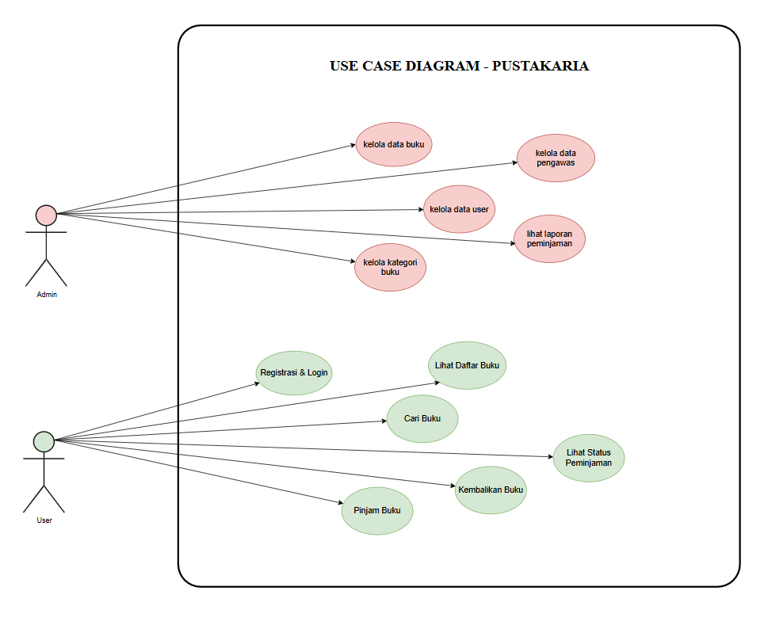
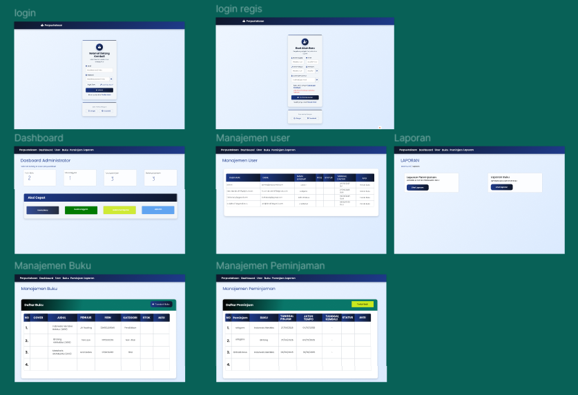
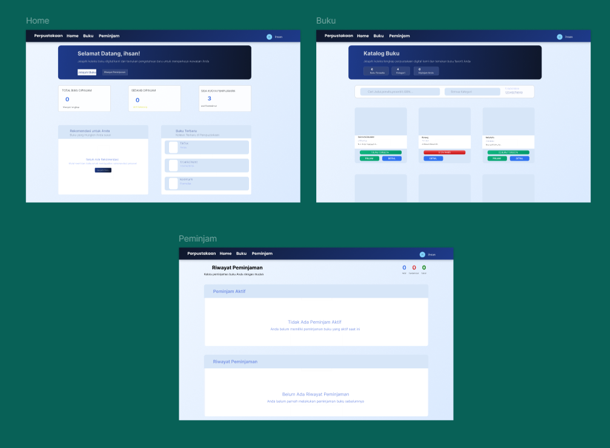
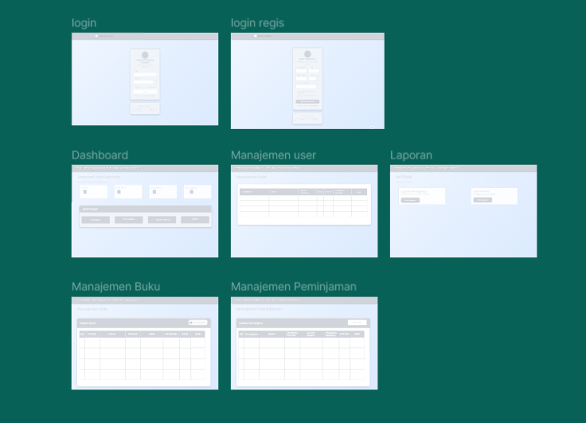
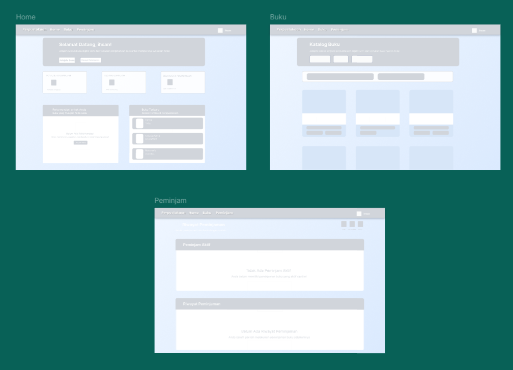

# 📚 Pustakaria - Sistem Manajemen Perpustakaan Online

  
  
  
  

## 👥 Tim Pengembang

<table align="center">
  <tr>
    <th>Nama</th>
    <th>NIM</th>
    <th>GitHub</th>
    <th>Role</th>
  </tr>
  <tr>
    <td><strong>Ihsan Rangga</strong></td>
    <td>312310494</td>
    <td><a href="https://github.com/IHSANRANGGAMAHENDRA">@IHSANRANGGAMAHENDRA</a></td>
    <td>Frontend Developer</td>
  </tr>
  <tr>
    <td><strong>Faiz Maulana</strong></td>
    <td>312310469</td>
    <td><a href="https://github.com/PaisMaulanaaa">@PaisMaulanaaa</a></td>
    <td>Backend Developer</td>
  </tr>
  <tr>
    <td><strong>Ariq Ibtihal</strong></td>
    <td>312310446</td>
    <td><a href="https://github.com/ariq190505">@ariq190505</a></td>
    <td>Database Engineer</td>
  </tr>
  <tr>
    <td><strong>Ali Mubaroq</strong></td>
    <td>312310452</td>
    <td><a href="https://github.com/alimubaroq">@alimubaroq</a></td>
    <td>Deployment & DevOps</td>
  </tr>
</table>

---

## 📋 Deskripsi Proyek

**Pustakaria** adalah sistem manajemen perpustakaan online berbasis web yang dirancang untuk merevolusi cara perpustakaan beroperasi. Platform ini menyediakan solusi digital yang efisien bagi administrator (pustakawan) untuk mengelola koleksi buku, anggota, dan transaksi peminjaman. Di sisi lain, para anggota (pengguna) dapat dengan mudah menjelajahi katalog, meminjam buku, dan melihat riwayat peminjaman mereka secara online.

Dibangun dengan framework **CodeIgniter 4** yang andal, Pustakaria menawarkan backend yang cepat dan aman. Antarmuka pengguna yang modern dan responsif diimplementasikan menggunakan **Bootstrap 5**, memastikan pengalaman pengguna yang optimal di berbagai perangkat. Seluruh data, mulai dari detail buku hingga riwayat peminjaman, disimpan dalam database **MySQL** yang terstruktur.

## 🌐 **Website Demo:** [https://pustakaria.ct.ws/](https://pustakaria.ct.ws/)

### 🎯 **Tujuan Proyek**

1.  **Digitalisasi Operasional Perpustakaan** - Menggantikan sistem manual dengan platform digital yang terintegrasi dan efisien.
2.  **Kemudahan Akses untuk Anggota** - Memberikan kemudahan bagi anggota untuk mencari dan meminjam buku dari mana saja.
3.  **Manajemen Koleksi Terpusat** - Menyediakan satu platform bagi pustakawan untuk mengelola seluruh koleksi buku dan data anggota.
4.  **Optimalisasi Pengalaman Pengguna** - Menciptakan antarmuka yang intuitif dan mudah digunakan baik untuk pustakawan maupun anggota.
5.  **Pelaporan dan Analitik** - Menyediakan data dan laporan untuk membantu pustakawan dalam mengambil keputusan strategis.

### ✨ Fitur Utama

#### 🔐 **Akun Administrator (Pustakawan)**

-   **Dashboard Admin** - Tampilan ringkasan statistik kunci seperti total buku, jumlah anggota, dan buku yang sedang dipinjam.
-   **Manajemen Buku (CRUD)** - Fitur lengkap untuk menambah, melihat, mengubah, dan menghapus data buku, termasuk mengunggah gambar sampul.
-   **Manajemen Anggota** - Mengelola data seluruh anggota terdaftar, termasuk melihat detail dan status keanggotaan.
-   **Manajemen Peminjaman** - Memantau semua transaksi peminjaman, melakukan konfirmasi pengembalian, dan melihat riwayat peminjaman per anggota.
-   **Laporan** - Menghasilkan laporan mengenai aktivitas perpustakaan, seperti buku terpopuler dan statistik peminjaman.

#### 👤 **Akun Pengguna (Anggota)**

-   **Dashboard Anggota** - Halaman personal yang menampilkan ringkasan buku yang sedang dipinjam dan riwayat peminjaman.
-   **Katalog Buku Online** - Menjelajahi semua koleksi buku yang tersedia dengan fitur pencarian dan filter.
-   **Detail Buku** - Melihat informasi lengkap mengenai buku, termasuk sinopsis, penulis, penerbit, dan ketersediaan.
-   **Proses Peminjaman** - Mengajukan peminjaman buku secara online melalui sistem yang mudah dan cepat.
-   **Manajemen Profil** - Mengelola informasi pribadi dan mengubah kata sandi untuk keamanan akun.

---

## ⚙️ Analisis Sistem & Use Case

### ⚙️ Diagram Use Case

  
   <strong>Diagram Use Case - Pustakaria</strong>

---

## 🎨 Design & Mockup

### 📱 Mockup Aplikasi

  <table>
    <tr>
      <td align="center">
        
         <strong>Mockup Akun Admin</strong>
      </td>
      <td align="center">
        
         <strong>Mockup Akun Pengguna</strong>
      </td>
    </tr>
  </table>

---

## 📖 Storyboard Aplikasi

### 🔧 **Akun Administrator**

  

#### **Alur Kerja Admin:**

1.  **🔐 Halaman Login** - Form login aman untuk pustakawan.
2.  **📊 Dashboard Admin** - Ringkasan statistik dan akses cepat ke fitur utama.
3.  **📚 Kelola Buku** - Tabel daftar buku dengan aksi CRUD (Create, Read, Update, Delete).
4.  **👥 Kelola Anggota** - Melihat dan mengelola data anggota terdaftar.
5.  **➕ Tambah Buku** - Form untuk menambahkan buku baru ke dalam koleksi.
6.  **📈 Laporan** - Melihat laporan peminjaman dan statistik lainnya.

### 👤 **Akun Pengguna (User)**

  

#### **Alur Kerja Pengguna:**

1.  **🔐 Halaman Login** - Antarmuka login untuk anggota.
2.  **🏠 Home Dashboard** - Ringkasan personal dan buku yang sedang dipinjam.
3.  **📖 Katalog Buku** - Menjelajahi dan mencari koleksi buku yang tersedia.
4.  **📝 Detail & Pinjam Buku** - Melihat detail buku dan mengajukan peminjaman.
5.  **🏆 Riwayat Peminjaman** - Melihat daftar buku yang pernah dan sedang dipinjam.
6.  **👤 Profil Pengguna** - Mengedit informasi pribadi dan mengubah kata sandi.

---

## 🚀 Teknologi yang Digunakan

### 🔧 **Backend Technologies**

-   **PHP 8.1+** - Bahasa pemrograman server-side yang menjadi fondasi dari aplikasi.
-   **CodeIgniter 4** - Framework PHP ringan dan cepat dengan arsitektur MVC untuk pengembangan yang terstruktur.
-   **MySQL 8.0** - Sistem manajemen database relasional untuk menyimpan semua data aplikasi secara andal.

### 🎨 **Frontend Technologies**

-   **HTML5** - Markup language standar untuk membuat struktur halaman web yang semantik.
-   **CSS3** - Digunakan untuk styling kustom, termasuk tema, layout, dan animasi.
-   **JavaScript ES6+** - Meningkatkan interaktivitas di sisi klien, seperti validasi form dan notifikasi dinamis.
-   **Bootstrap 5** - Framework CSS untuk membangun desain yang responsif dan mobile-first dengan cepat.

### 📚 **Libraries & Tools**

-   **Font Awesome** - Menyediakan koleksi ikon vektor untuk mempercantik antarmuka.
-   **jQuery** - Library JavaScript yang mempermudah manipulasi DOM dan interaksi AJAX.
-   **SweetAlert2** - Digunakan untuk menampilkan notifikasi dan dialog konfirmasi yang elegan.
-   **DataTables** - Plugin untuk membuat tabel data yang interaktif dengan fitur pencarian, sorting, dan paginasi.

### 🔒 **Security & Performance**

-   **Password Hashing** - Mengamankan kata sandi pengguna menggunakan fungsi `password_hash()` bawaan PHP.
-   **CSRF Protection** - Perlindungan otomatis dari CodeIgniter 4 untuk mencegah serangan Cross-Site Request Forgery.
-   **Validasi Input** - Menerapkan validasi data di sisi server untuk mencegah serangan seperti SQL Injection dan XSS.

---

## 🎯 Fitur Unggulan

### 🔥 **Highlights**

-   **Desain Responsif** - Tampilan yang beradaptasi dengan baik di desktop, tablet, dan smartphone.
-   **Manajemen Data Real-time** - Semua perubahan data langsung ter-update di seluruh sistem.
-   **Sistem Peminjaman Online** - Proses peminjaman dan pengembalian buku yang terdigitalisasi.
-   **Pencarian Canggih** - Fitur pencarian yang memudahkan anggota menemukan buku.
-   **Otentikasi Aman** - Sistem login yang aman dengan pembagian hak akses (Admin dan Anggota).

### 🎨 **UI/UX Features**

-   **Navigasi Intuitif** - Alur pengguna yang jelas dan mudah diikuti.
-   **Tabel Interaktif** - Data disajikan dalam tabel yang mudah diurutkan dan dicari.
-   **Notifikasi Real-time** - Umpan balik visual untuk setiap aksi yang dilakukan pengguna.

---

## 🌐 Demo & Deployment

> **Note:** Aplikasi ini siap untuk di-hosting dengan konfigurasi yang sudah dioptimalkan.

### 📋 **Persyaratan Sistem**

-   PHP 8.0 atau lebih tinggi
-   MySQL 8.0 atau MariaDB 10.4+
-   Composer (untuk manajemen dependensi)

  <strong>💡 Pustakaria berakhir di sini, tapi petualangan membaca kamu baru dimulai! 💡</strong>
    
  <em>Proyek ini lahir dari semangat dan dedikasi ❤️ oleh Tim Pengembang</em>
    
  📬 Feedback? Saran? Kami selalu terbuka!
   
   
  <strong>📚 Terima Kasih Telah Menggunakan Pustakaria! 📚</strong>

